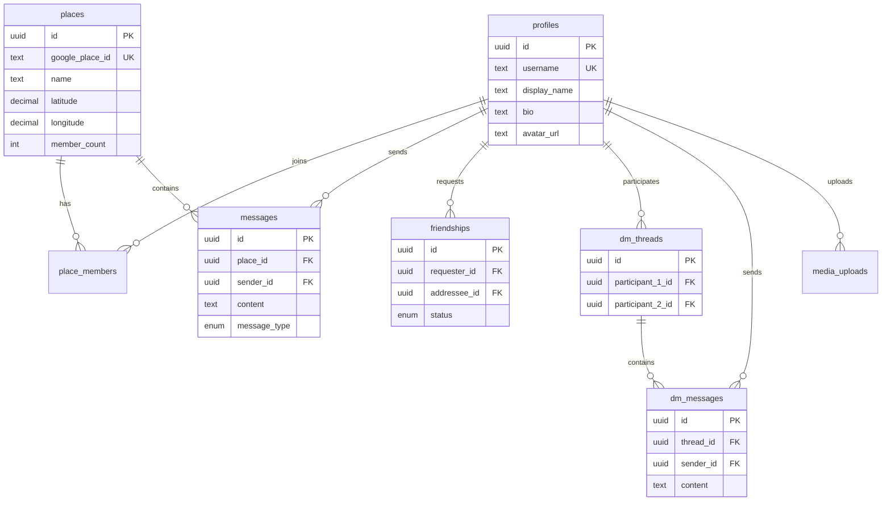

# BUILD-IDEA.MD
## PlaceChat MVP - Community Chat Rooms Anchored to Real-World Locations

**Version:** 1.0.0  
**Target:** 10,000 MAU  
**Architecture Philosophy:** Cost-conscious, cache-first, graceful degradation

---

## TABLE OF CONTENTS

1. [Project Summary](#1-project-summary)
2. [Database Schema](#2-database-schema)
3. [API Architecture](#3-api-architecture)
4. [Security Rules (RLS)](#4-security-rules-rls)
5. [Component Map](#5-component-map)
6. [Step-by-Step Build Plan](#6-step-by-step-build-plan)
7. [Cost Optimization Strategies](#7-cost-optimization-strategies)
8. [Fail-Safe & Degradation Logic](#8-fail-safe--degradation-logic)

---

## 1. PROJECT SUMMARY

### Core Concept
PlaceChat transforms real-world locations into persistent chat communities. Users discover places via Google Places API, join place-specific group chats, and connect with others through mutual-consent DMs.

### Tech Stack
| Layer | Technology | Purpose |
|-------|------------|---------|
| Frontend | Next.js 14+ (App Router) | SSR, routing, API routes |
| Styling | Tailwind CSS | Utility-first CSS |
| Icons | Lucide React | Lightweight icon library |
| Backend | Supabase | PostgreSQL, Auth, Realtime, Storage |
| Hosting | Vercel | Edge deployment, serverless functions |
| External API | Google Places API (New) | Location search & details |

### Feature Priority Matrix
| Priority | Feature | Complexity |
|----------|---------|------------|
| P0 | Auth (Email/OAuth) | Low |
| P0 | Places Search with Caching | Medium |
| P0 | Place Chat Rooms | Medium |
| P1 | User Profiles | Low |
| P1 | Media Sharing | Medium |
| P2 | Private DMs (Mutual Opt-in) | High |

---

## 2. DATABASE SCHEMA

### 2.1 Complete SQL Schema

```sql
-- ============================================
-- EXTENSION SETUP
-- ============================================
CREATE EXTENSION IF NOT EXISTS "uuid-ossp";
CREATE EXTENSION IF NOT EXISTS "postgis"; -- For geo queries (optional optimization)

-- ============================================
-- ENUMS
-- ============================================
CREATE TYPE friendship_status AS ENUM ('pending', 'accepted', 'blocked');
CREATE TYPE message_type AS ENUM ('text', 'image', 'system');

-- ============================================
-- TABLE: profiles
-- Extended user data beyond Supabase auth.users
-- ============================================
CREATE TABLE profiles (
    id UUID PRIMARY KEY REFERENCES auth.users(id) ON DELETE CASCADE,
    username TEXT UNIQUE NOT NULL,
    display_name TEXT,
    bio TEXT CHECK (char_length(bio) <= 500),
    avatar_url TEXT,
    location_text TEXT, -- User's self-described location
    is_online BOOLEAN DEFAULT FALSE,
    last_seen_at TIMESTAMPTZ DEFAULT NOW(),
    created_at TIMESTAMPTZ DEFAULT NOW(),
    updated_at TIMESTAMPTZ DEFAULT NOW()
);

-- Index for username lookups
CREATE INDEX idx_profiles_username ON profiles(username);
CREATE INDEX idx_profiles_online ON profiles(is_online) WHERE is_online = TRUE;

-- ============================================
-- TABLE: places
-- Cached Google Places data (CACHE-FIRST STRATEGY)
-- ============================================
CREATE TABLE places (
    id UUID PRIMARY KEY DEFAULT uuid_generate_v4(),
    google_place_id TEXT UNIQUE NOT NULL, -- Google's place_id
    name TEXT NOT NULL,
    formatted_address TEXT,
    latitude DECIMAL(10, 8) NOT NULL,
    longitude DECIMAL(11, 8) NOT NULL,
    place_types TEXT[], -- e.g., ['restaurant', 'food']
    photo_reference TEXT, -- Google photo reference for caching
    cached_photo_url TEXT, -- Our Supabase Storage URL
    rating DECIMAL(2, 1),
    user_ratings_total INTEGER,
    
    -- Cache management
    cache_expires_at TIMESTAMPTZ DEFAULT (NOW() + INTERVAL '7 days'),
    fetch_count INTEGER DEFAULT 1, -- Track popularity
    last_fetched_at TIMESTAMPTZ DEFAULT NOW(),
    
    -- Chat room metadata
    member_count INTEGER DEFAULT 0,
    message_count INTEGER DEFAULT 0,
    is_active BOOLEAN DEFAULT TRUE,
    
    created_at TIMESTAMPTZ DEFAULT NOW(),
    updated_at TIMESTAMPTZ DEFAULT NOW()
);

-- Indexes for search and cache management
CREATE INDEX idx_places_google_id ON places(google_place_id);
CREATE INDEX idx_places_location ON places(latitude, longitude);
CREATE INDEX idx_places_cache_expiry ON places(cache_expires_at);
CREATE INDEX idx_places_popularity ON places(fetch_count DESC, member_count DESC);
CREATE INDEX idx_places_name_search ON places USING gin(to_tsvector('english', name));

-- ============================================
-- TABLE: place_members
-- Tracks which users have joined which place chats
-- ============================================
CREATE TABLE place_members (
    id UUID PRIMARY KEY DEFAULT uuid_generate_v4(),
    place_id UUID NOT NULL REFERENCES places(id) ON DELETE CASCADE,
    user_id UUID NOT NULL REFERENCES profiles(id) ON DELETE CASCADE,
    nickname TEXT, -- Optional place-specific nickname
    is_muted BOOLEAN DEFAULT FALSE,
    last_read_at TIMESTAMPTZ DEFAULT NOW(),
    joined_at TIMESTAMPTZ DEFAULT NOW(),
    
    UNIQUE(place_id, user_id)
);

CREATE INDEX idx_place_members_place ON place_members(place_id);
CREATE INDEX idx_place_members_user ON place_members(user_id);

-- ============================================
-- TABLE: messages
-- Place chat room messages
-- ============================================
CREATE TABLE messages (
    id UUID PRIMARY KEY DEFAULT uuid_generate_v4(),
    place_id UUID NOT NULL REFERENCES places(id) ON DELETE CASCADE,
    sender_id UUID NOT NULL REFERENCES profiles(id) ON DELETE CASCADE,
    content TEXT CHECK (char_length(content) <= 4000),
    message_type message_type DEFAULT 'text',
    media_url TEXT, -- For image messages
    media_thumbnail_url TEXT, -- Compressed thumbnail
    reply_to_id UUID REFERENCES messages(id) ON DELETE SET NULL,
    is_edited BOOLEAN DEFAULT FALSE,
    is_deleted BOOLEAN DEFAULT FALSE, -- Soft delete
    created_at TIMESTAMPTZ DEFAULT NOW(),
    updated_at TIMESTAMPTZ DEFAULT NOW()
);

-- Indexes for message retrieval
CREATE INDEX idx_messages_place ON messages(place_id, created_at DESC);
CREATE INDEX idx_messages_sender ON messages(sender_id);
CREATE INDEX idx_messages_created ON messages(created_at DESC);

-- ============================================
-- TABLE: friendships
-- Mutual opt-in DM system (ANTI-SPAM)
-- ============================================
CREATE TABLE friendships (
    id UUID PRIMARY KEY DEFAULT uuid_generate_v4(),
    requester_id UUID NOT NULL REFERENCES profiles(id) ON DELETE CASCADE,
    addressee_id UUID NOT NULL REFERENCES profiles(id) ON DELETE CASCADE,
    status friendship_status DEFAULT 'pending',
    requested_at TIMESTAMPTZ DEFAULT NOW(),
    responded_at TIMESTAMPTZ,
    
    -- Prevent duplicate requests
    UNIQUE(requester_id, addressee_id),
    -- Prevent self-friending
    CHECK (requester_id != addressee_id)
);

CREATE INDEX idx_friendships_requester ON friendships(requester_id);
CREATE INDEX idx_friendships_addressee ON friendships(addressee_id);
CREATE INDEX idx_friendships_status ON friendships(status);

-- ============================================
-- TABLE: dm_threads
-- Direct message conversations (only between friends)
-- ============================================
CREATE TABLE dm_threads (
    id UUID PRIMARY KEY DEFAULT uuid_generate_v4(),
    participant_1_id UUID NOT NULL REFERENCES profiles(id) ON DELETE CASCADE,
    participant_2_id UUID NOT NULL REFERENCES profiles(id) ON DELETE CASCADE,
    
    -- Denormalized for faster queries
    last_message_at TIMESTAMPTZ,
    last_message_preview TEXT,
    
    created_at TIMESTAMPTZ DEFAULT NOW(),
    
    -- Ensure unique thread per pair (order-independent)
    UNIQUE(LEAST(participant_1_id, participant_2_id), GREATEST(participant_1_id, participant_2_id)),
    CHECK (participant_1_id != participant_2_id)
);

CREATE INDEX idx_dm_threads_participants ON dm_threads(participant_1_id, participant_2_id);

-- ============================================
-- TABLE: dm_messages
-- Messages within DM threads
-- ============================================
CREATE TABLE dm_messages (
    id UUID PRIMARY KEY DEFAULT uuid_generate_v4(),
    thread_id UUID NOT NULL REFERENCES dm_threads(id) ON DELETE CASCADE,
    sender_id UUID NOT NULL REFERENCES profiles(id) ON DELETE CASCADE,
    content TEXT CHECK (char_length(content) <= 4000),
    message_type message_type DEFAULT 'text',
    media_url TEXT,
    media_thumbnail_url TEXT,
    is_read BOOLEAN DEFAULT FALSE,
    is_deleted BOOLEAN DEFAULT FALSE,
    created_at TIMESTAMPTZ DEFAULT NOW()
);

CREATE INDEX idx_dm_messages_thread ON dm_messages(thread_id, created_at DESC);
CREATE INDEX idx_dm_messages_unread ON dm_messages(thread_id, is_read) WHERE is_read = FALSE;

-- ============================================
-- TABLE: media_uploads
-- Track all uploaded media for quota management
-- ============================================
CREATE TABLE media_uploads (
    id UUID PRIMARY KEY DEFAULT uuid_generate_v4(),
    user_id UUID NOT NULL REFERENCES profiles(id) ON DELETE CASCADE,
    storage_path TEXT NOT NULL,
    original_filename TEXT,
    file_size_bytes INTEGER NOT NULL,
    mime_type TEXT NOT NULL,
    width INTEGER,
    height INTEGER,
    
    -- Compression metadata
    is_compressed BOOLEAN DEFAULT TRUE,
    original_size_bytes INTEGER,
    compression_ratio DECIMAL(4, 2),
    
    created_at TIMESTAMPTZ DEFAULT NOW()
);

CREATE INDEX idx_media_uploads_user ON media_uploads(user_id);

-- ============================================
-- TABLE: api_cache_log
-- Track Google API usage for monitoring
-- ============================================
CREATE TABLE api_cache_log (
    id UUID PRIMARY KEY DEFAULT uuid_generate_v4(),
    api_type TEXT NOT NULL, -- 'places_search', 'place_details', 'place_photo'
    cache_hit BOOLEAN NOT NULL,
    query_hash TEXT, -- For deduplication analysis
    response_time_ms INTEGER,
    created_at TIMESTAMPTZ DEFAULT NOW()
);

CREATE INDEX idx_api_cache_log_type ON api_cache_log(api_type, created_at DESC);

-- ============================================
-- FUNCTIONS & TRIGGERS
-- ============================================

-- Auto-update updated_at timestamp
CREATE OR REPLACE FUNCTION update_updated_at()
RETURNS TRIGGER AS $$
BEGIN
    NEW.updated_at = NOW();
    RETURN NEW;
END;
$$ LANGUAGE plpgsql;

CREATE TRIGGER profiles_updated_at
    BEFORE UPDATE ON profiles
    FOR EACH ROW EXECUTE FUNCTION update_updated_at();

CREATE TRIGGER places_updated_at
    BEFORE UPDATE ON places
    FOR EACH ROW EXECUTE FUNCTION update_updated_at();

CREATE TRIGGER messages_updated_at
    BEFORE UPDATE ON messages
    FOR EACH ROW EXECUTE FUNCTION update_updated_at();

-- Update place member count
CREATE OR REPLACE FUNCTION update_place_member_count()
RETURNS TRIGGER AS $$
BEGIN
    IF TG_OP = 'INSERT' THEN
        UPDATE places SET member_count = member_count + 1 WHERE id = NEW.place_id;
    ELSIF TG_OP = 'DELETE' THEN
        UPDATE places SET member_count = member_count - 1 WHERE id = OLD.place_id;
    END IF;
    RETURN NULL;
END;
$$ LANGUAGE plpgsql;

CREATE TRIGGER place_members_count
    AFTER INSERT OR DELETE ON place_members
    FOR EACH ROW EXECUTE FUNCTION update_place_member_count();

-- Update place message count
CREATE OR REPLACE FUNCTION update_place_message_count()
RETURNS TRIGGER AS $$
BEGIN
    IF TG_OP = 'INSERT' THEN
        UPDATE places SET message_count = message_count + 1 WHERE id = NEW.place_id;
    END IF;
    RETURN NULL;
END;
$$ LANGUAGE plpgsql;

CREATE TRIGGER place_messages_count
    AFTER INSERT ON messages
    FOR EACH ROW EXECUTE FUNCTION update_place_message_count();

-- Update DM thread last message
CREATE OR REPLACE FUNCTION update_dm_thread_last_message()
RETURNS TRIGGER AS $$
BEGIN
    UPDATE dm_threads SET 
        last_message_at = NEW.created_at,
        last_message_preview = LEFT(NEW.content, 100)
    WHERE id = NEW.thread_id;
    RETURN NULL;
END;
$$ LANGUAGE plpgsql;

CREATE TRIGGER dm_messages_update_thread
    AFTER INSERT ON dm_messages
    FOR EACH ROW EXECUTE FUNCTION update_dm_thread_last_message();

-- Auto-create profile on user signup
CREATE OR REPLACE FUNCTION handle_new_user()
RETURNS TRIGGER AS $$
BEGIN
    INSERT INTO profiles (id, username, display_name, avatar_url)
    VALUES (
        NEW.id,
        COALESCE(NEW.raw_user_meta_data->>'username', 'user_' || LEFT(NEW.id::text, 8)),
        COALESCE(NEW.raw_user_meta_data->>'full_name', NEW.raw_user_meta_data->>'name'),
        NEW.raw_user_meta_data->>'avatar_url'
    );
    RETURN NEW;
END;
$$ LANGUAGE plpgsql SECURITY DEFINER;

CREATE TRIGGER on_auth_user_created
    AFTER INSERT ON auth.users
    FOR EACH ROW EXECUTE FUNCTION handle_new_user();

-- ============================================
-- HELPER FUNCTIONS
-- ============================================

-- Check if two users are friends (accepted)
CREATE OR REPLACE FUNCTION are_friends(user_a UUID, user_b UUID)
RETURNS BOOLEAN AS $$
BEGIN
    RETURN EXISTS (
        SELECT 1 FROM friendships
        WHERE status = 'accepted'
        AND (
            (requester_id = user_a AND addressee_id = user_b)
            OR (requester_id = user_b AND addressee_id = user_a)
        )
    );
END;
$$ LANGUAGE plpgsql SECURITY DEFINER;

-- Get or create DM thread between two friends
CREATE OR REPLACE FUNCTION get_or_create_dm_thread(user_a UUID, user_b UUID)
RETURNS UUID AS $$
DECLARE
    thread_id UUID;
BEGIN
    -- Check friendship first
    IF NOT are_friends(user_a, user_b) THEN
        RAISE EXCEPTION 'Users must be friends to start a DM';
    END IF;
    
    -- Find existing thread
    SELECT id INTO thread_id FROM dm_threads
    WHERE (participant_1_id = user_a AND participant_2_id = user_b)
       OR (participant_1_id = user_b AND participant_2_id = user_a);
    
    -- Create if not exists
    IF thread_id IS NULL THEN
        INSERT INTO dm_threads (participant_1_id, participant_2_id)
        VALUES (LEAST(user_a, user_b), GREATEST(user_a, user_b))
        RETURNING id INTO thread_id;
    END IF;
    
    RETURN thread_id;
END;
$$ LANGUAGE plpgsql SECURITY DEFINER;

-- Get popular places (for fallback)
CREATE OR REPLACE FUNCTION get_popular_places(limit_count INTEGER DEFAULT 20)
RETURNS SETOF places AS $$
BEGIN
    RETURN QUERY
    SELECT * FROM places
    WHERE is_active = TRUE
    ORDER BY 
        (fetch_count * 0.3 + member_count * 0.5 + message_count * 0.2) DESC,
        created_at DESC
    LIMIT limit_count;
END;
$$ LANGUAGE plpgsql;
```

### 2.2 Entity Relationship Diagram (Mermaid)



---

## 3. API ARCHITECTURE

### 3.1 API Route Structure

```
app/
├── api/
│   ├── places/
│   │   ├── search/
│   │   │   └── route.ts          # GET: Proxy to Google Places with caching
│   │   ├── [placeId]/
│   │   │   ├── route.ts          # GET: Place details with caching
│   │   │   ├── join/
│   │   │   │   └── route.ts      # POST: Join place chat
│   │   │   └── leave/
│   │   │       └── route.ts      # POST: Leave place chat
│   │   └── popular/
│   │       └── route.ts          # GET: Popular/cached places (fallback)
│   ├── messages/
│   │   ├── route.ts              # POST: Send message
│   │   └── [placeId]/
│   │       └── route.ts          # GET: Fetch messages (paginated)
│   ├── friends/
│   │   ├── route.ts              # GET: List friends, POST: Send request
│   │   ├── requests/
│   │   │   └── route.ts          # GET: Pending requests
│   │   └── [friendshipId]/
│   │       └── route.ts          # PATCH: Accept/reject, DELETE: Remove
│   ├── dm/
│   │   ├── threads/
│   │   │   └── route.ts          # GET: List DM threads
│   │   └── [threadId]/
│   │       ├── route.ts          # GET: Messages, POST: Send
│   │       └── read/
│   │           └── route.ts      # POST: Mark as read
│   ├── profile/
│   │   ├── route.ts              # GET/PATCH: Current user profile
│   │   └── [userId]/
│   │       └── route.ts          # GET: Public profile
│   └── upload/
│       └── route.ts              # POST: Presigned URL for media upload
```

### 3.2 Google Places Caching Flow

```typescript
// app/api/places/search/route.ts

import { NextRequest, NextResponse } from 'next/server';
import { createClient } from '@/lib/supabase/server';

// Session token management for autocomplete billing optimization
const sessionTokens = new Map<string, { token: string; expires: number }>();

function getSessionToken(userId: string): string {
  const existing = sessionTokens.get(userId);
  const now = Date.now();
  
  // Tokens expire after 3 minutes (Google's session window)
  if (existing && existing.expires > now) {
    return existing.token;
  }
  
  const newToken = crypto.randomUUID();
  sessionTokens.set(userId, { token: newToken, expires: now + 180000 });
  return newToken;
}

export async function GET(request: NextRequest) {
  const supabase = createClient();
  const { data: { user } } = await supabase.auth.getUser();
  
  if (!user) {
    return NextResponse.json({ error: 'Unauthorized' }, { status: 401 });
  }
  
  const query = request.nextUrl.searchParams.get('q');
  const lat = request.nextUrl.searchParams.get('lat');
  const lng = request.nextUrl.searchParams.get('lng');
  
  if (!query || query.length < 2) {
    return NextResponse.json({ error: 'Query too short' }, { status: 400 });
  }
  
  // ============================================
  // STEP 1: Check Supabase cache first
  // ============================================
  const { data: cachedPlaces } = await supabase
    .from('places')
    .select('*')
    .ilike('name', `%${query}%`)
    .gte('cache_expires_at', new Date().toISOString())
    .limit(10);
  
  // Log cache hit for monitoring
  await supabase.from('api_cache_log').insert({
    api_type: 'places_search',
    cache_hit: (cachedPlaces?.length ?? 0) > 0,
    query_hash: Buffer.from(query.toLowerCase()).toString('base64').slice(0, 20)
  });
  
  // If we have enough cached results, return them
  if (cachedPlaces && cachedPlaces.length >= 5) {
    return NextResponse.json({ 
      places: cachedPlaces,
      source: 'cache'
    });
  }
  
  // ============================================
  // STEP 2: Query Google Places API with field masking
  // ============================================
  const sessionToken = getSessionToken(user.id);
  
  try {
    // Using the new Google Places API (v1)
    const googleResponse = await fetch(
      'https://places.googleapis.com/v1/places:searchText',
      {
        method: 'POST',
        headers: {
          'Content-Type': 'application/json',
          'X-Goog-Api-Key': process.env.GOOGLE_PLACES_API_KEY!,
          // CRITICAL: Field masking reduces billing
          'X-Goog-FieldMask': 'places.id,places.displayName,places.formattedAddress,places.location,places.types,places.rating,places.userRatingCount,places.photos'
        },
        body: JSON.stringify({
          textQuery: query,
          locationBias: lat && lng ? {
            circle: {
              center: { latitude: parseFloat(lat), longitude: parseFloat(lng) },
              radius: 10000 // 10km radius
            }
          } : undefined,
          maxResultCount: 10
        })
      }
    );
    
    if (!googleResponse.ok) {
      // ============================================
      // FAIL-SAFE: Return cached popular places on API failure
      // ============================================
      console.error('Google API error:', await googleResponse.text());
      const { data: fallbackPlaces } = await supabase.rpc('get_popular_places', { limit_count: 20 });
      
      return NextResponse.json({
        places: fallbackPlaces,
        source: 'fallback',
        message: 'Showing popular places due to search unavailability'
      });
    }
    
    const data = await googleResponse.json();
    
    // ============================================
    // STEP 3: Cache new results in Supabase
    // ============================================
    const placesToCache = data.places?.map((place: any) => ({
      google_place_id: place.id,
      name: place.displayName?.text || 'Unknown Place',
      formatted_address: place.formattedAddress,
      latitude: place.location?.latitude,
      longitude: place.location?.longitude,
      place_types: place.types || [],
      photo_reference: place.photos?.[0]?.name,
      rating: place.rating,
      user_ratings_total: place.userRatingCount,
      cache_expires_at: new Date(Date.now() + 7 * 24 * 60 * 60 * 1000).toISOString(),
      last_fetched_at: new Date().toISOString()
    })) || [];
    
    if (placesToCache.length > 0) {
      // Upsert to handle duplicates
      await supabase
        .from('places')
        .upsert(placesToCache, { 
          onConflict: 'google_place_id',
          ignoreDuplicates: false 
        });
    }
    
    // Fetch the upserted records to get our internal IDs
    const { data: insertedPlaces } = await supabase
      .from('places')
      .select('*')
      .in('google_place_id', placesToCache.map((p: any) => p.google_place_id));
    
    return NextResponse.json({
      places: insertedPlaces,
      source: 'google'
    });
    
  } catch (error) {
    console.error('Places search error:', error);
    
    // FAIL-SAFE: Return popular places
    const { data: fallbackPlaces } = await supabase.rpc('get_popular_places', { limit_count: 20 });
    
    return NextResponse.json({
      places: fallbackPlaces || cachedPlaces || [],
      source: 'fallback',
      message: 'Search temporarily unavailable'
    });
  }
}
```

### 3.3 Image Compression Pipeline

```typescript
// lib/image-compression.ts

import imageCompression from 'browser-image-compression';

export interface CompressionResult {
  file: File;
  originalSize: number;
  compressedSize: number;
  compressionRatio: number;
  width: number;
  height: number;
}

export async function compressImage(
  file: File,
  options?: {
    maxSizeMB?: number;
    maxWidthOrHeight?: number;
    useWebWorker?: boolean;
  }
): Promise<CompressionResult> {
  const defaultOptions = {
    maxSizeMB: 0.5,           // Max 500KB
    maxWidthOrHeight: 1920,   // Max dimension
    useWebWorker: true,       // Use web worker for performance
    initialQuality: 0.8,
    ...options
  };
  
  const originalSize = file.size;
  
  // Get original dimensions
  const imageBitmap = await createImageBitmap(file);
  const originalWidth = imageBitmap.width;
  const originalHeight = imageBitmap.height;
  imageBitmap.close();
  
  // Skip compression if already small
  if (originalSize < 100 * 1024 && originalWidth <= 1920) {
    return {
      file,
      originalSize,
      compressedSize: originalSize,
      compressionRatio: 1,
      width: originalWidth,
      height: originalHeight
    };
  }
  
  const compressedFile = await imageCompression(file, defaultOptions);
  
  // Get compressed dimensions
  const compressedBitmap = await createImageBitmap(compressedFile);
  const width = compressedBitmap.width;
  const height = compressedBitmap.height;
  compressedBitmap.close();
  
  return {
    file: compressedFile,
    originalSize,
    compressedSize: compressedFile.size,
    compressionRatio: parseFloat((originalSize / compressedFile.size).toFixed(2)),
    width,
    height
  };
}

export async function createThumbnail(file: File): Promise<File> {
  return imageCompression(file, {
    maxSizeMB: 0.05,        // 50KB max for thumbnails
    maxWidthOrHeight: 300,
    useWebWorker: true
  });
}
```

### 3.4 Media Upload Route

```typescript
// app/api/upload/route.ts

import { NextRequest, NextResponse } from 'next/server';
import { createClient } from '@/lib/supabase/server';

export async function POST(request: NextRequest) {
  const supabase = createClient();
  const { data: { user } } = await supabase.auth.getUser();
  
  if (!user) {
    return NextResponse.json({ error: 'Unauthorized' }, { status: 401 });
  }
  
  const formData = await request.formData();
  const file = formData.get('file') as File;
  const thumbnail = formData.get('thumbnail') as File | null;
  const metadata = JSON.parse(formData.get('metadata') as string || '{}');
  
  if (!file) {
    return NextResponse.json({ error: 'No file provided' }, { status: 400 });
  }
  
  // Validate file size (should already be compressed client-side)
  const MAX_SIZE = 2 * 1024 * 1024; // 2MB server-side limit
  if (file.size > MAX_SIZE) {
    return NextResponse.json({ 
      error: 'File too large. Please compress before uploading.' 
    }, { status: 400 });
  }
  
  // Generate unique path
  const timestamp = Date.now();
  const extension = file.name.split('.').pop() || 'jpg';
  const filePath = `${user.id}/${timestamp}.${extension}`;
  const thumbnailPath = thumbnail ? `${user.id}/${timestamp}_thumb.${extension}` : null;
  
  // Upload main file
  const { data: uploadData, error: uploadError } = await supabase.storage
    .from('media')
    .upload(filePath, file, {
      contentType: file.type,
      upsert: false
    });
  
  if (uploadError) {
    console.error('Upload error:', uploadError);
    return NextResponse.json({ error: 'Upload failed' }, { status: 500 });
  }
  
  // Upload thumbnail if provided
  let thumbnailUrl = null;
  if (thumbnail && thumbnailPath) {
    const { error: thumbError } = await supabase.storage
      .from('media')
      .upload(thumbnailPath, thumbnail, {
        contentType: thumbnail.type,
        upsert: false
      });
    
    if (!thumbError) {
      const { data: { publicUrl: thumbPublic } } = supabase.storage
        .from('media')
        .getPublicUrl(thumbnailPath);
      thumbnailUrl = thumbPublic;
    }
  }
  
  // Get public URL
  const { data: { publicUrl } } = supabase.storage
    .from('media')
    .getPublicUrl(filePath);
  
  // Log upload for quota tracking
  await supabase.from('media_uploads').insert({
    user_id: user.id,
    storage_path: filePath,
    original_filename: file.name,
    file_size_bytes: file.size,
    mime_type: file.type,
    width: metadata.width,
    height: metadata.height,
    is_compressed: metadata.isCompressed ?? true,
    original_size_bytes: metadata.originalSize,
    compression_ratio: metadata.compressionRatio
  });
  
  return NextResponse.json({
    url: publicUrl,
    thumbnailUrl,
    path: filePath
  });
}
```

---

## 4. SECURITY RULES (RLS)

### 4.1 Row Level Security Policies

```sql
-- ============================================
-- ENABLE RLS ON ALL TABLES
-- ============================================
ALTER TABLE profiles ENABLE ROW LEVEL SECURITY;
ALTER TABLE places ENABLE ROW LEVEL SECURITY;
ALTER TABLE place_members ENABLE ROW LEVEL SECURITY;
ALTER TABLE messages ENABLE ROW LEVEL SECURITY;
ALTER TABLE friendships ENABLE ROW LEVEL SECURITY;
ALTER TABLE dm_threads ENABLE ROW LEVEL SECURITY;
ALTER TABLE dm_messages ENABLE ROW LEVEL SECURITY;
ALTER TABLE media_uploads ENABLE ROW LEVEL SECURITY;
ALTER TABLE api_cache_log ENABLE ROW LEVEL SECURITY;

-- ============================================
-- PROFILES POLICIES
-- ============================================

-- Anyone can view profiles (public)
CREATE POLICY "Profiles are publicly viewable"
ON profiles FOR SELECT
USING (true);

-- Users can only update their own profile
CREATE POLICY "Users can update own profile"
ON profiles FOR UPDATE
USING (auth.uid() = id)
WITH CHECK (auth.uid() = id);

-- Users can insert their own profile (trigger handles this, but just in case)
CREATE POLICY "Users can insert own profile"
ON profiles FOR INSERT
WITH CHECK (auth.uid() = id);

-- ============================================
-- PLACES POLICIES
-- ============================================

-- Anyone authenticated can view places
CREATE POLICY "Places are viewable by authenticated users"
ON places FOR SELECT
TO authenticated
USING (true);

-- Only server (service role) can insert/update places
-- No user policy needed; API routes use service role

-- ============================================
-- PLACE MEMBERS POLICIES
-- ============================================

-- Users can see members of places they've joined
CREATE POLICY "Members can view place members"
ON place_members FOR SELECT
TO authenticated
USING (
  EXISTS (
    SELECT 1 FROM place_members pm
    WHERE pm.place_id = place_members.place_id
    AND pm.user_id = auth.uid()
  )
);

-- Users can join places (insert themselves)
CREATE POLICY "Users can join places"
ON place_members FOR INSERT
TO authenticated
WITH CHECK (user_id = auth.uid());

-- Users can leave places (delete themselves)
CREATE POLICY "Users can leave places"
ON place_members FOR DELETE
TO authenticated
USING (user_id = auth.uid());

-- Users can update their own membership (mute, etc.)
CREATE POLICY "Users can update own membership"
ON place_members FOR UPDATE
TO authenticated
USING (user_id = auth.uid())
WITH CHECK (user_id = auth.uid());

-- ============================================
-- MESSAGES POLICIES
-- ============================================

-- Members can view messages in places they've joined
CREATE POLICY "Members can view place messages"
ON messages FOR SELECT
TO authenticated
USING (
  EXISTS (
    SELECT 1 FROM place_members
    WHERE place_id = messages.place_id
    AND user_id = auth.uid()
  )
);

-- Members can send messages to places they've joined
CREATE POLICY "Members can send messages"
ON messages FOR INSERT
TO authenticated
WITH CHECK (
  sender_id = auth.uid()
  AND EXISTS (
    SELECT 1 FROM place_members
    WHERE place_id = messages.place_id
    AND user_id = auth.uid()
  )
);

-- Users can edit their own messages
CREATE POLICY "Users can edit own messages"
ON messages FOR UPDATE
TO authenticated
USING (sender_id = auth.uid())
WITH CHECK (sender_id = auth.uid());

-- Users can soft-delete their own messages
CREATE POLICY "Users can delete own messages"
ON messages FOR DELETE
TO authenticated
USING (sender_id = auth.uid());

-- ============================================
-- FRIENDSHIPS POLICIES (Mutual Opt-in)
-- ============================================

-- Users can see their own friend requests (sent or received)
CREATE POLICY "Users can view own friendships"
ON friendships FOR SELECT
TO authenticated
USING (
  requester_id = auth.uid() OR addressee_id = auth.uid()
);

-- Users can send friend requests
CREATE POLICY "Users can send friend requests"
ON friendships FOR INSERT
TO authenticated
WITH CHECK (
  requester_id = auth.uid()
  -- Prevent duplicate/reverse requests via constraint
);

-- Addressee can update (accept/reject) requests
CREATE POLICY "Addressee can respond to requests"
ON friendships FOR UPDATE
TO authenticated
USING (addressee_id = auth.uid())
WITH CHECK (addressee_id = auth.uid());

-- Either party can delete (unfriend/cancel)
CREATE POLICY "Users can remove friendships"
ON friendships FOR DELETE
TO authenticated
USING (
  requester_id = auth.uid() OR addressee_id = auth.uid()
);

-- ============================================
-- DM THREADS POLICIES
-- ============================================

-- Users can only see threads they're part of
CREATE POLICY "Users can view own DM threads"
ON dm_threads FOR SELECT
TO authenticated
USING (
  participant_1_id = auth.uid() OR participant_2_id = auth.uid()
);

-- Threads created via function (get_or_create_dm_thread)
-- No direct insert policy needed; use RPC

-- ============================================
-- DM MESSAGES POLICIES
-- ============================================

-- Users can view messages in their threads
CREATE POLICY "Users can view DM messages in their threads"
ON dm_messages FOR SELECT
TO authenticated
USING (
  EXISTS (
    SELECT 1 FROM dm_threads
    WHERE id = dm_messages.thread_id
    AND (participant_1_id = auth.uid() OR participant_2_id = auth.uid())
  )
);

-- Users can send messages to their threads
CREATE POLICY "Users can send DMs in their threads"
ON dm_messages FOR INSERT
TO authenticated
WITH CHECK (
  sender_id = auth.uid()
  AND EXISTS (
    SELECT 1 FROM dm_threads
    WHERE id = dm_messages.thread_id
    AND (participant_1_id = auth.uid() OR participant_2_id = auth.uid())
  )
);

-- Users can delete their own DMs
CREATE POLICY "Users can delete own DMs"
ON dm_messages FOR DELETE
TO authenticated
USING (sender_id = auth.uid());

-- ============================================
-- MEDIA UPLOADS POLICIES
-- ============================================

-- Users can only see their own uploads
CREATE POLICY "Users can view own uploads"
ON media_uploads FOR SELECT
TO authenticated
USING (user_id = auth.uid());

-- Users can insert their own uploads
CREATE POLICY "Users can create uploads"
ON media_uploads FOR INSERT
TO authenticated
WITH CHECK (user_id = auth.uid());

-- ============================================
-- STORAGE BUCKET POLICIES
-- ============================================

-- Run in Supabase Dashboard > Storage > Policies

-- CREATE POLICY "Avatar upload"
-- ON storage.objects FOR INSERT
-- TO authenticated
-- WITH CHECK (
--   bucket_id = 'avatars' 
--   AND (storage.foldername(name))[1] = auth.uid()::text
-- );

-- CREATE POLICY "Avatar public access"
-- ON storage.objects FOR SELECT
-- TO public
-- USING (bucket_id = 'avatars');

-- CREATE POLICY "Media upload by owner"
-- ON storage.objects FOR INSERT
-- TO authenticated
-- WITH CHECK (
--   bucket_id = 'media'
--   AND (storage.foldername(name))[1] = auth.uid()::text
-- );

-- CREATE POLICY "Media viewable by authenticated"
-- ON storage.objects FOR SELECT
-- TO authenticated
-- USING (bucket_id = 'media');
```

---

## 5. COMPONENT MAP

### 5.1 Folder Structure

```
src/
├── app/
│   ├── (auth)/
│   │   ├── login/
│   │   │   └── page.tsx
│   │   ├── signup/
│   │   │   └── page.tsx
│   │   └── layout.tsx
│   ├── (main)/
│   │   ├── page.tsx                    # Home/Discovery
│   │   ├── places/
│   │   │   ├── page.tsx                # Places search
│   │   │   └── [placeId]/
│   │   │       └── page.tsx            # Chat room
│   │   ├── messages/
│   │   │   ├── page.tsx                # DM inbox
│   │   │   └── [threadId]/
│   │   │       └── page.tsx            # DM conversation
│   │   ├── friends/
│   │   │   └── page.tsx                # Friends & requests
│   │   ├── profile/
│   │   │   ├── page.tsx                # Own profile
│   │   │   └── [userId]/
│   │   │       └── page.tsx            # Other user profile
│   │   └── layout.tsx                  # Main app shell
│   ├── api/
│   │   └── [...routes as defined above]
│   ├── layout.tsx                      # Root layout
│   └── globals.css
├── components/
│   ├── ui/                             # Primitive UI components
│   │   ├── Button.tsx
│   │   ├── Input.tsx
│   │   ├── Avatar.tsx
│   │   ├── Badge.tsx
│   │   ├── Modal.tsx
│   │   ├── Dropdown.tsx
│   │   ├── Skeleton.tsx
│   │   ├── Toast.tsx
│   │   └── index.ts
│   ├── layout/                         # Layout components
│   │   ├── Header.tsx
│   │   ├── Sidebar.tsx
│   │   ├── MobileNav.tsx
│   │   └── AppShell.tsx
│   ├── auth/                           # Authentication
│   │   ├── LoginForm.tsx
│   │   ├── SignupForm.tsx
│   │   ├── AuthProvider.tsx
│   │   └── ProtectedRoute.tsx
│   ├── places/                         # Places/Discovery
│   │   ├── PlaceSearchBar.tsx          # Autocomplete search
│   │   ├── PlaceCard.tsx               # Place preview card
│   │   ├── PlaceGrid.tsx               # Grid of place cards
│   │   ├── PlaceDetails.tsx            # Full place info
│   │   ├── PopularPlaces.tsx           # Fallback popular places
│   │   └── NearbyPlaces.tsx            # Location-based discovery
│   ├── chat/                           # Chat components
│   │   ├── ChatRoom.tsx                # Main chat room container
│   │   ├── MessageList.tsx             # Scrollable message list
│   │   ├── MessageItem.tsx             # Single message display
│   │   ├── MessageInput.tsx            # Compose message
│   │   ├── MessageMedia.tsx            # Image attachment display
│   │   ├── TypingIndicator.tsx
│   │   ├── MemberList.tsx              # Room participants
│   │   └── ChatHeader.tsx              # Room header with info
│   ├── dm/                             # Direct messages
│   │   ├── DMThreadList.tsx            # Inbox thread list
│   │   ├── DMThreadItem.tsx            # Single thread preview
│   │   ├── DMConversation.tsx          # Full DM view
│   │   └── DMCompose.tsx               # New DM (friend select)
│   ├── friends/                        # Friendship system
│   │   ├── FriendList.tsx
│   │   ├── FriendCard.tsx
│   │   ├── FriendRequestList.tsx
│   │   ├── FriendRequestCard.tsx
│   │   └── AddFriendModal.tsx
│   ├── profile/                        # User profiles
│   │   ├── ProfileCard.tsx             # Compact profile view
│   │   ├── ProfileHeader.tsx           # Full profile header
│   │   ├── ProfileForm.tsx             # Edit profile form
│   │   ├── AvatarUpload.tsx            # Profile pic upload
│   │   └── ProfileStats.tsx            # Activity stats
│   ├── media/                          # Media handling
│   │   ├── ImageUpload.tsx             # Upload with compression
│   │   ├── ImagePreview.tsx            # Preview before send
│   │   ├── ImageViewer.tsx             # Fullscreen lightbox
│   │   └── MediaGallery.tsx            # Media grid view
│   └── shared/                         # Shared components
│       ├── EmptyState.tsx
│       ├── LoadingSpinner.tsx
│       ├── ErrorBoundary.tsx
│       ├── InfiniteScroll.tsx
│       └── OnlineIndicator.tsx
├── hooks/                              # Custom React hooks
│   ├── useAuth.ts
│   ├── useProfile.ts
│   ├── usePlaces.ts
│   ├── useMessages.ts
│   ├── useRealtime.ts
│   ├── useFriends.ts
│   ├── useDM.ts
│   ├── useImageCompression.ts
│   ├── useGeolocation.ts
│   └── useDebounce.ts
├── lib/                                # Utilities & configs
│   ├── supabase/
│   │   ├── client.ts                   # Browser client
│   │   ├── server.ts                   # Server client
│   │   ├── middleware.ts               # Auth middleware
│   │   └── types.ts                    # Generated types
│   ├── utils/
│   │   ├── format.ts                   # Date/string formatting
│   │   ├── validation.ts               # Input validation
│   │   └── constants.ts                # App constants
│   ├── image-compression.ts            # Compression utils
│   └── google-places.ts                # Places API helpers
├── stores/                             # State management (Zustand)
│   ├── authStore.ts
│   ├── chatStore.ts
│   └── uiStore.ts
├── types/                              # TypeScript definitions
│   ├── database.ts                     # Supabase generated
│   ├── api.ts                          # API response types
│   └── common.ts                       # Shared types
└── styles/
    └── globals.css                     # Tailwind base styles
```

### 5.2 Key Component Specifications

#### PlaceSearchBar.tsx
```typescript
interface PlaceSearchBarProps {
  onPlaceSelect: (place: Place) => void;
  placeholder?: string;
  showNearby?: boolean;
}

// Features:
// - Debounced input (300ms)
// - Session token for Google billing optimization
// - Cache-first search via API
// - Keyboard navigation
// - Loading & error states
// - Fallback to popular places on error
```

#### ChatRoom.tsx
```typescript
interface ChatRoomProps {
  placeId: string;
}

// Features:
// - Supabase Realtime subscription
// - Infinite scroll with pagination
// - Message grouping by sender/time
// - Typing indicators
// - Image uploads with preview
// - Member presence
// - Optimistic updates
```

#### MessageInput.tsx
```typescript
interface MessageInputProps {
  placeId: string;
  onSend: (message: NewMessage) => Promise<void>;
  replyTo?: Message;
}

// Features:
// - Text input with emoji picker
// - Image attachment with compression preview
// - Reply-to functionality
// - Character limit (4000)
// - Send on Enter, Shift+Enter for newline
// - Disabled state during send
```

#### ImageUpload.tsx
```typescript
interface ImageUploadProps {
  onUpload: (result: UploadResult) => void;
  maxSizeMB?: number;
  showPreview?: boolean;
}

// Features:
// - Client-side compression before upload
// - Thumbnail generation
// - Progress indicator
// - File type validation
// - Drag & drop support
// - Paste from clipboard
```

---

## 6. STEP-BY-STEP BUILD PLAN

### Phase 0: Project Setup (Day 1)

```markdown
### TASK 0.1: Initialize Next.js Project
- [ ] Run: `npx create-next-app@latest placechat --typescript --tailwind --eslint --app --src-dir`
- [ ] Install dependencies:
  ```bash
  npm install @supabase/supabase-js @supabase/ssr lucide-react zustand browser-image-compression date-fns
  npm install -D supabase @types/node
  ```

### TASK 0.2: Supabase Setup
- [ ] Create Supabase project at supabase.com
- [ ] Copy project URL and anon key to `.env.local`:
  ```
  NEXT_PUBLIC_SUPABASE_URL=your_url
  NEXT_PUBLIC_SUPABASE_ANON_KEY=your_anon_key
  SUPABASE_SERVICE_ROLE_KEY=your_service_key
  GOOGLE_PLACES_API_KEY=your_google_key
  ```
- [ ] Run schema SQL in Supabase SQL Editor
- [ ] Enable RLS policies
- [ ] Create storage buckets: `avatars`, `media`
- [ ] Configure bucket policies

### TASK 0.3: Supabase Client Configuration
- [ ] Create `/lib/supabase/client.ts` (browser client)
- [ ] Create `/lib/supabase/server.ts` (server client)
- [ ] Create `/lib/supabase/middleware.ts` (auth middleware)
- [ ] Generate TypeScript types: `npx supabase gen types typescript`

### TASK 0.4: Base UI Components
- [ ] Create primitive components in `/components/ui/`:
  - Button, Input, Avatar, Badge, Modal, Dropdown, Skeleton, Toast
- [ ] Configure Tailwind theme in `tailwind.config.ts`
- [ ] Set up global styles in `globals.css`
```

### Phase 1: Authentication (Day 2)

```markdown
### TASK 1.1: Auth Provider Setup
- [ ] Create `AuthProvider.tsx` wrapping app with session state
- [ ] Implement `useAuth.ts` hook for auth operations
- [ ] Add auth state to Zustand store

### TASK 1.2: Auth Pages
- [ ] Build `/app/(auth)/login/page.tsx` with email/password and OAuth
- [ ] Build `/app/(auth)/signup/page.tsx` with username selection
- [ ] Create `LoginForm.tsx` and `SignupForm.tsx` components
- [ ] Add form validation with error messages

### TASK 1.3: Protected Routes
- [ ] Implement `ProtectedRoute.tsx` wrapper
- [ ] Add middleware for session refresh
- [ ] Configure redirect logic for unauthenticated users

### TASK 1.4: Profile Auto-Creation
- [ ] Verify `handle_new_user()` trigger works
- [ ] Test profile creation on signup
- [ ] Handle OAuth metadata (avatar, name)
```

### Phase 2: User Profiles (Day 3)

```markdown
### TASK 2.1: Profile Components
- [ ] Build `ProfileCard.tsx` (compact view)
- [ ] Build `ProfileHeader.tsx` (full profile view)
- [ ] Build `ProfileForm.tsx` (edit form)
- [ ] Build `AvatarUpload.tsx` with image compression

### TASK 2.2: Profile Pages
- [ ] Create `/app/(main)/profile/page.tsx` (own profile)
- [ ] Create `/app/(main)/profile/[userId]/page.tsx` (view others)
- [ ] Implement `useProfile.ts` hook

### TASK 2.3: Profile API
- [ ] Create `/api/profile/route.ts` (GET/PATCH own profile)
- [ ] Create `/api/profile/[userId]/route.ts` (GET public profile)
- [ ] Add avatar upload to storage bucket
```

### Phase 3: Places Discovery (Day 4-5)

```markdown
### TASK 3.1: Google Places Integration
- [ ] Create `/lib/google-places.ts` helper functions
- [ ] Implement session token management
- [ ] Configure field masking for cost optimization

### TASK 3.2: Places API Routes
- [ ] Build `/api/places/search/route.ts` with caching flow:
  1. Check Supabase cache
  2. If insufficient, query Google
  3. Cache results
  4. Log cache hit/miss
- [ ] Build `/api/places/[placeId]/route.ts` for details
- [ ] Build `/api/places/popular/route.ts` for fallback

### TASK 3.3: Places Components
- [ ] Build `PlaceSearchBar.tsx`:
  - Debounced search
  - Autocomplete dropdown
  - Keyboard navigation
  - Loading states
- [ ] Build `PlaceCard.tsx` with cached photo
- [ ] Build `PlaceGrid.tsx` with lazy loading
- [ ] Build `PopularPlaces.tsx` fallback component
- [ ] Build `NearbyPlaces.tsx` with geolocation

### TASK 3.4: Discovery Page
- [ ] Create `/app/(main)/places/page.tsx`
- [ ] Implement `usePlaces.ts` hook
- [ ] Add geolocation permission handling
- [ ] Test fail-safe fallback to popular places

### TASK 3.5: Caching Verification
- [ ] Verify 7-day cache expiry works
- [ ] Test cache hit logging
- [ ] Confirm Google API calls are minimized
```

### Phase 4: Chat Room Implementation (Day 6-8)

```markdown
### TASK 4.1: Realtime Setup
- [ ] Configure Supabase Realtime for `messages` table
- [ ] Create `useRealtime.ts` hook
- [ ] Structure channels by `place_id` for efficiency

### TASK 4.2: Chat Components
- [ ] Build `ChatRoom.tsx` container:
  - Realtime subscription
  - Scroll management
  - Presence tracking
- [ ] Build `MessageList.tsx`:
  - Infinite scroll (50 messages per page)
  - Message grouping logic
  - Date separators
- [ ] Build `MessageItem.tsx`:
  - Text/image rendering
  - Reply thread
  - Edit/delete options
- [ ] Build `MessageInput.tsx`:
  - Text input with emoji
  - Image attachment
  - Send/loading states
- [ ] Build `ChatHeader.tsx` with room info
- [ ] Build `MemberList.tsx` sidebar

### TASK 4.3: Chat API Routes
- [ ] Create `/api/messages/[placeId]/route.ts` (GET paginated)
- [ ] Create `/api/messages/route.ts` (POST new message)
- [ ] Implement optimistic updates

### TASK 4.4: Chat Page
- [ ] Create `/app/(main)/places/[placeId]/page.tsx`
- [ ] Implement `useMessages.ts` hook
- [ ] Add join/leave place logic
- [ ] Test real-time message delivery

### TASK 4.5: Place Membership
- [ ] Create `/api/places/[placeId]/join/route.ts`
- [ ] Create `/api/places/[placeId]/leave/route.ts`
- [ ] Update member count triggers
```

### Phase 5: Media Sharing (Day 9-10)

```markdown
### TASK 5.1: Image Compression Pipeline
- [ ] Implement `/lib/image-compression.ts`
- [ ] Create `useImageCompression.ts` hook
- [ ] Test compression ratios and quality

### TASK 5.2: Upload Components
- [ ] Build `ImageUpload.tsx`:
  - File picker
  - Drag & drop
  - Clipboard paste
  - Compression preview
- [ ] Build `ImagePreview.tsx` before send
- [ ] Build `ImageViewer.tsx` lightbox
- [ ] Build `MediaGallery.tsx` grid

### TASK 5.3: Upload API
- [ ] Create `/api/upload/route.ts`
- [ ] Generate thumbnails
- [ ] Track uploads in `media_uploads` table
- [ ] Validate file types and sizes

### TASK 5.4: Integration
- [ ] Connect `ImageUpload` to `MessageInput`
- [ ] Display images in `MessageItem`
- [ ] Add click-to-expand functionality
```

### Phase 6: Friendship System (Day 11-12)

```markdown
### TASK 6.1: Friendship API
- [ ] Create `/api/friends/route.ts`:
  - GET: List friends
  - POST: Send request
- [ ] Create `/api/friends/requests/route.ts`:
  - GET: Pending requests
- [ ] Create `/api/friends/[friendshipId]/route.ts`:
  - PATCH: Accept/reject/block
  - DELETE: Unfriend

### TASK 6.2: Friendship Components
- [ ] Build `FriendList.tsx`
- [ ] Build `FriendCard.tsx` with actions
- [ ] Build `FriendRequestList.tsx`
- [ ] Build `FriendRequestCard.tsx` with accept/reject
- [ ] Build `AddFriendModal.tsx` with user search

### TASK 6.3: Friends Page
- [ ] Create `/app/(main)/friends/page.tsx`
- [ ] Implement `useFriends.ts` hook
- [ ] Add friend request notifications

### TASK 6.4: Profile Integration
- [ ] Add "Add Friend" button to profile pages
- [ ] Show friendship status on profiles
- [ ] Implement block functionality
```

### Phase 7: Direct Messages (Day 13-15)

```markdown
### TASK 7.1: DM API Routes
- [ ] Create `/api/dm/threads/route.ts`:
  - GET: List user's DM threads
- [ ] Create `/api/dm/[threadId]/route.ts`:
  - GET: Messages in thread
  - POST: Send DM
- [ ] Create `/api/dm/[threadId]/read/route.ts`:
  - POST: Mark as read

### TASK 7.2: DM Components
- [ ] Build `DMThreadList.tsx`:
  - Thread previews
  - Unread counts
  - Online status
- [ ] Build `DMThreadItem.tsx`
- [ ] Build `DMConversation.tsx`:
  - Realtime messages
  - Typing indicator
  - Image support
- [ ] Build `DMCompose.tsx`:
  - Friend selector
  - New thread creation

### TASK 7.3: DM Pages
- [ ] Create `/app/(main)/messages/page.tsx` (inbox)
- [ ] Create `/app/(main)/messages/[threadId]/page.tsx`
- [ ] Implement `useDM.ts` hook

### TASK 7.4: DM Realtime
- [ ] Subscribe to new messages
- [ ] Update thread list in real-time
- [ ] Handle read receipts

### TASK 7.5: Mutual Opt-in Enforcement
- [ ] Verify `are_friends()` function works
- [ ] Test that non-friends cannot DM
- [ ] Add helpful error messages
```

### Phase 8: App Shell & Navigation (Day 16)

```markdown
### TASK 8.1: Layout Components
- [ ] Build `AppShell.tsx` with responsive layout
- [ ] Build `Header.tsx` with user menu
- [ ] Build `Sidebar.tsx` with navigation
- [ ] Build `MobileNav.tsx` bottom navigation

### TASK 8.2: Navigation
- [ ] Implement active state indicators
- [ ] Add notification badges
- [ ] Create smooth transitions

### TASK 8.3: Main Layout
- [ ] Update `/app/(main)/layout.tsx`
- [ ] Add loading skeletons
- [ ] Implement error boundaries
```

### Phase 9: Polish & Optimization (Day 17-18)

```markdown
### TASK 9.1: Performance
- [ ] Add React Query or SWR for caching
- [ ] Implement virtualized lists for messages
- [ ] Lazy load images with blur placeholders
- [ ] Optimize bundle size

### TASK 9.2: Error Handling
- [ ] Create `ErrorBoundary.tsx`
- [ ] Add toast notifications for errors
- [ ] Implement retry logic for failed requests

### TASK 9.3: Offline Support
- [ ] Queue messages when offline
- [ ] Show connection status
- [ ] Sync when reconnected

### TASK 9.4: Accessibility
- [ ] Add ARIA labels
- [ ] Keyboard navigation
- [ ] Focus management
- [ ] Screen reader testing

### TASK 9.5: Testing
- [ ] Test Google API fallback
- [ ] Test RLS policies
- [ ] Load test Realtime connections
- [ ] Cross-browser testing
```

### Phase 10: Deployment (Day 19-20)

```markdown
### TASK 10.1: Environment Setup
- [ ] Configure Vercel project
- [ ] Set environment variables
- [ ] Configure custom domain

### TASK 10.2: Supabase Production
- [ ] Review RLS policies
- [ ] Enable database backups
- [ ] Configure connection pooling
- [ ] Set rate limits

### TASK 10.3: Monitoring
- [ ] Set up error tracking (Sentry)
- [ ] Configure analytics
- [ ] Create dashboard for API cache hits

### TASK 10.4: Launch Checklist
- [ ] Security audit
- [ ] Performance audit (Lighthouse)
- [ ] Mobile responsiveness check
- [ ] Final user acceptance testing
```

---

## 7. COST OPTIMIZATION STRATEGIES

### 7.1 Google Places API

| Strategy | Implementation | Savings |
|----------|---------------|---------|
| Field Masking | Request only needed fields | ~40% per request |
| Session Tokens | Group autocomplete + details | ~50% on autocomplete |
| Aggressive Caching | 7-day cache in Supabase | 80%+ reduction |
| Popular Places Fallback | Pre-cached hot places | 100% when fallback active |

### 7.2 Supabase

| Resource | Limit (Pro) | Strategy |
|----------|-------------|----------|
| Database | 8GB | Soft delete, pagination, archival policy |
| Storage | 100GB | Client-side compression (50-80% reduction) |
| Realtime | 500 concurrent | Channel per place (not per user) |
| Auth | 50K MAU | Email verification to reduce bot signups |

### 7.3 Vercel

| Resource | Limit (Pro) | Strategy |
|----------|-------------|----------|
| Serverless | 1000 GB-hrs | Edge functions for static routes |
| Bandwidth | 1TB | Image compression, CDN caching |
| Build | 6000 mins | Incremental builds, cache deps |

### 7.4 Estimated Monthly Costs (10K MAU)

```
Supabase Pro:        $25
Vercel Pro:          $20
Google Places API:   $50-100 (with caching)
Domain:              $1
─────────────────────────
Total:               ~$100-150/month
```

---

## 8. FAIL-SAFE & DEGRADATION LOGIC

### 8.1 Google Places API Failures

```typescript
// Fail-safe cascade in order of preference
const searchPlaces = async (query: string): Promise<SearchResult> => {
  try {
    // 1. Try cache first
    const cached = await searchCache(query);
    if (cached.length >= 5) return { places: cached, source: 'cache' };
    
    // 2. Try Google API
    const google = await searchGoogle(query);
    await cacheResults(google);
    return { places: google, source: 'google' };
    
  } catch (googleError) {
    // 3. Fallback to partial cache
    const partialCache = await searchCache(query);
    if (partialCache.length > 0) {
      return { 
        places: partialCache, 
        source: 'cache',
        warning: 'Showing cached results only'
      };
    }
    
    // 4. Ultimate fallback: popular places
    const popular = await getPopularPlaces(20);
    return {
      places: popular,
      source: 'fallback',
      warning: 'Search unavailable. Showing popular places.'
    };
  }
};
```

### 8.2 Realtime Connection Failures

```typescript
// Reconnection with exponential backoff
const connectRealtime = async (placeId: string) => {
  let attempts = 0;
  const maxAttempts = 5;
  
  const connect = async () => {
    try {
      const channel = supabase
        .channel(`place:${placeId}`)
        .on('postgres_changes', { ... })
        .subscribe();
      
      return channel;
    } catch (error) {
      attempts++;
      if (attempts < maxAttempts) {
        const delay = Math.pow(2, attempts) * 1000;
        await sleep(delay);
        return connect();
      }
      // Fallback to polling
      return startPolling(placeId);
    }
  };
  
  return connect();
};
```

### 8.3 Image Upload Failures

```typescript
// Queue failed uploads for retry
const uploadWithRetry = async (file: File) => {
  const compressed = await compressImage(file);
  
  try {
    return await uploadToStorage(compressed.file);
  } catch (error) {
    // Save to IndexedDB for later
    await queueForRetry({
      file: compressed.file,
      timestamp: Date.now(),
      context: getCurrentMessageContext()
    });
    
    throw new UploadQueuedError('Upload queued for retry');
  }
};

// Periodic retry of queued uploads
const retryQueuedUploads = async () => {
  const queued = await getQueuedUploads();
  for (const item of queued) {
    try {
      await uploadToStorage(item.file);
      await removeFromQueue(item.id);
    } catch {
      // Keep in queue, will retry later
    }
  }
};
```

### 8.4 Graceful Degradation UI States

```typescript
// Component states for degradation
type ServiceStatus = 'online' | 'degraded' | 'offline';

const StatusBanner: React.FC<{ status: ServiceStatus }> = ({ status }) => {
  const messages = {
    online: null,
    degraded: 'Some features may be limited. We\'re working on it.',
    offline: 'You\'re offline. Messages will be sent when you reconnect.'
  };
  
  if (status === 'online') return null;
  
  return (
    <div className={`banner banner-${status}`}>
      <AlertCircle />
      <span>{messages[status]}</span>
    </div>
  );
};
```

---

## APPENDIX A: Environment Variables

```env
# .env.local

# Supabase
NEXT_PUBLIC_SUPABASE_URL=https://your-project.supabase.co
NEXT_PUBLIC_SUPABASE_ANON_KEY=your-anon-key
SUPABASE_SERVICE_ROLE_KEY=your-service-role-key

# Google Places
GOOGLE_PLACES_API_KEY=your-google-api-key

# App Config
NEXT_PUBLIC_APP_URL=http://localhost:3000
NEXT_PUBLIC_APP_NAME=PlaceChat
```

---

## APPENDIX B: Supabase CLI Commands

```bash
# Initialize Supabase locally
npx supabase init

# Start local development
npx supabase start

# Generate TypeScript types
npx supabase gen types typescript --project-id your-project-id > src/types/database.ts

# Push migrations
npx supabase db push

# Pull remote changes
npx supabase db pull
```

---

## APPENDIX C: Deployment Checklist

```markdown
## Pre-Deploy
- [ ] All environment variables configured in Vercel
- [ ] Supabase project upgraded to Pro plan
- [ ] Google Places API billing enabled with budget alerts
- [ ] RLS policies tested with different user roles
- [ ] Storage bucket policies configured

## Deploy
- [ ] Push to main branch (triggers Vercel deploy)
- [ ] Verify build succeeds
- [ ] Run smoke tests on preview URL
- [ ] Promote to production

## Post-Deploy
- [ ] Monitor error rates in Sentry/Vercel
- [ ] Check Supabase dashboard for query performance
- [ ] Verify Realtime connections are stable
- [ ] Test Google API caching is working
- [ ] Review first 24h of api_cache_log data
```

---

**END OF BUILD-IDEA.MD**

*This document is designed for AI coding agents. Execute tasks in order, validate each phase before proceeding, and refer to the fail-safe logic when implementing error handling.*
